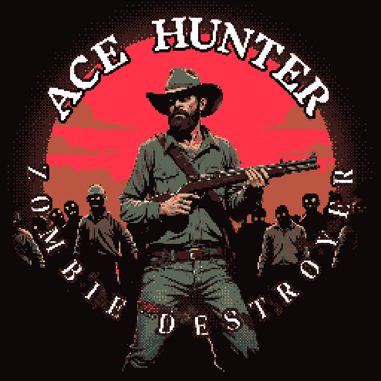

# ☠💤☠Zombie Destroyer
Fly, Defend, Survive.

Prepare for an adrenaline-pumping retro-styled adventure in Zombie Destroyer – a vintage style game where your mission is simple: obliterate waves of the undead and protect what’s left of civilization. 💀 

Play online: <a href="https://neuromodern.github.io/Zombie_Destroyer/">https://neuromodern.github.io/Zombie_Destroyer/</a>
 
 Zombie destroyer Release 1.0.2 
-  Music https://www.producer.ai/song/d2c09897-4f89-4362-8cc3-3e46e758554c

 Zombie destroyer Release 1.0.1 
-  UI/GUI: Balances, HP bars, and screens reimagined in stunning retro pixel art.
-  Retro VHS Shader: Immerse yourself in nostalgic 80s vibes with our new glitchy VHS shader effects.
-  Enhanced Location Design: Dive into completed environments with improved details and new models.
-  Sound Effects & Radiocasts: Amplify the tension with eerie soundscapes and haunting radio transmissions.
- ⚔ Win/Lose Battle Logic: Feel the thrill of victory or the sting of defeat with fully implemented battle scripts.
